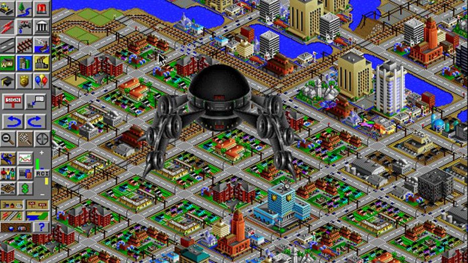
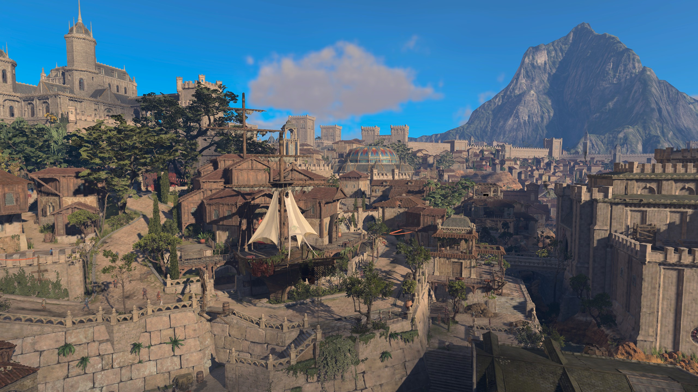

## Introduction

This first couple of weeks are what I would like to call "Sprint 0". During this time I applied to WolverineSoft, had my first meeting, and created this website! Below you will find a breakdown of everything that I did and the time it took for me to do those respective tasks.

## Week One

### Application (1hr)
I applied to WolverineSoft on September 11th, the application form was quite simpler, a lot easier than what I had filled out in the past two semesters. Just asked for contact information, year and class load, as well as seeing which department we would be most interested in. I heard back on September 15th that a department challenge would be released the following morning at 8AM and would be due on the 18th at 6PM. That is where the chaos began...

### Technical Interview (6hr)
I was ready that Monday morning to start the challenge, despite having class from 9-5 that day. When I opened the requirements document I was quite overwhelmed as the studio wanted me to make a clone of the popular web game [Agar.io](agar.io "View game"). I was worried because I only had so much free time in order to complete the project with my other classes and my part-time job taking up a lot of time. I ended up taking a day off of work to complete it by Tuesday and submit by Wednesday. To my surprise however, the due date was pushed back on Tuesday night until that Friday, after I had finished the game... No worries I just submitted early which I suppose looked good on my application.

On to the actual development, I had to have two different types of enemies, stagnant and wandering. Stagnant were size 1 by default and could not move, while wandering enemies were a random size between 1-100 and randomly "wandered" around the play field. I had enemies change direction every 7 seconds, and combined the logic for the stagnant and wandering enemies by just removing the rigid bodies from the stagnant ones. Here is the script:

```csharp
using System.Collections;
using System.Collections.Generic;
using UnityEditor.Experimental.GraphView;
using UnityEngine;

public class Enemy : MonoBehaviour
{
    [SerializeField] float moveInterval = 7f; //How often to rotate
    [SerializeField] float speed = 2f;
    public int enemySize;

    private Vector2 moveDir;
    private Rigidbody2D rb;

    void Awake() 
    {
        rb = GetComponent<Rigidbody2D>();
        //If it has a rigid body it is a wandering enemy, therefore it needs a random size, otherwise it is the same
        if (rb != null)
        {
            enemySize = Mathf.RoundToInt(Random.value * 100);
            if (enemySize == 0) enemySize++;
            transform.localScale = new Vector2(enemySize * .1f, enemySize * .1f);
            StartCoroutine(ChangeDirection());
        }
        else enemySize = 1;
    }

    private void FixedUpdate()
    {
        //If the enemy is a wandering enemy then move it every frame, otherwise do nothing
        if (rb == null) return;
        rb.MovePosition(rb.position + moveDir * speed * Time.fixedDeltaTime);
    }

    //Coroutine for changing the wandering enemies direction every moveInterval
    IEnumerator ChangeDirection() 
    {
        while (true) 
        { 
            moveDir = new Vector2(Random.Range(-1, 1), Random.Range(-1, 1));
            yield return new WaitForSeconds(moveInterval);
        }
    }
}
```
I also needed a way for the enemies to spawn at the beginning of the game as well as when the player eats an enemy, this was done using a simple if-statement in the Update function. If I could refactor this code I would probably create an event which would be published by the player script when an enemy is eaten, rather than checking every frame. I do like how the script uses prefabs to spawn enemies though. Here is that script:
```csharp
using System.Collections;
using System.Collections.Generic;
using UnityEngine;

public class EnemySpawner : MonoBehaviour
{
    public GameObject stagPfab;
    public GameObject wandPfab;
    
    private int maxStag = 25;
    private int maxWand = 15;

    public int currentStag = 0;
    public int currentWand = 0;
    
    public float mapSize = 30; //Radius of map size to spawn random enemies

    //Initialize all the enemies
    private void Start()
    {
        for(int i = 0; i < maxStag; i++) 
        {
            SpawnEnemy(stagPfab);
            currentStag++;
        }
        for (int i = 0; i < maxWand; i++) 
        {
            SpawnEnemy(wandPfab);
            currentWand++;
        }
    }

    //Check for if an enemy has been eaten, if so, spawn another one
    public void Update()
    {
        if (currentStag < maxStag) 
        {
            SpawnEnemy(stagPfab);
            currentStag++;
        }else if (currentWand < maxWand) 
        {
            SpawnEnemy(wandPfab);
            currentWand++; 
        }
    }

    //Spawn an enemy in a random spot within the map
    private void SpawnEnemy(GameObject ePfab) 
    {
        float randX = Random.Range(-mapSize, mapSize);
        float randY = Random.Range(-mapSize, mapSize);

        Vector2 position = new Vector2(randX, randY);
        Instantiate(ePfab, position, Quaternion.identity);
    }
}
```

The last script was the player script which I had to have wasd movement, a way to check collisions with enemies, a way to eat enemies, a win condition (reaching size 100), and a way to game over. On top of all of that I had to create a animation to play when the player eats an enemy, this was done by using the Unity animation system and just keyframes which go from one color to another. There also had to be a small GUI which showed the player size. Here is that script:
```csharp
using System.Collections;
using System.Collections.Generic;
using TMPro;
using UnityEditor;
using UnityEngine;
using UnityEngine.InputSystem;
using UnityEngine.SceneManagement;

public class Player : MonoBehaviour
{
    private Rigidbody2D rb;
    private Vector2 moveDir;
    private Animator animator;
    private bool isPlaying; //Is the animation playing?

    public TextMeshProUGUI sizeText;
    public int size = 5;
    public float speed = 3f;
    public EnemySpawner spawner;

    //Assign variables
    void Start()
    {
        animator = GetComponent<Animator>();
        rb = GetComponent<Rigidbody2D>();
        sizeText.text = "Size: " + size;
    }
    
    private void FixedUpdate()
    {
        //Move the player
        rb.MovePosition(rb.position + moveDir * speed * Time.deltaTime);

        //Check the state of the animation, if it is finished set the bool to false
        AnimatorStateInfo stateInfo = animator.GetCurrentAnimatorStateInfo(0);
        if (stateInfo.IsName("Eating") & stateInfo.normalizedTime >= 1.0f)
        {
            animator.SetBool("isEating", false);
            isPlaying = false;
        }
    }

    //Messages sent by the input manager
    public void OnMove(InputValue value) 
    { 
        moveDir = value.Get<Vector2>();
    }

    public void OnMoveCanceled(InputValue value) 
    {
        moveDir = Vector2.zero;
    }

    private void OnCollisionEnter2D(Collision2D collision)
    {
        Enemy enemy = collision.gameObject.GetComponent<Enemy>();
        if (enemy == null) return; //Collision is not an enemy, continue!
        
        //If enemy is bigger you die!
        if (enemy.enemySize >= size)
        {
            SceneManager.LoadScene(SceneManager.GetActiveScene().buildIndex);
        }
        else 
        {
            //Add the size to you and increase your scale relatively
            size += enemy.enemySize;
            sizeText.text = "Size: " + size;
            transform.localScale = new Vector3(size*.1f, size*.1f, size*.1f);

            //Decrement for spawning and destroy the object
            if (enemy.gameObject.CompareTag("WandEnemy")) spawner.currentWand--;
            else spawner.currentStag--;
            Destroy(enemy.gameObject);

            //If the animation is not playing already then play it
            if (!isPlaying) 
            {
                animator.SetBool("isEating", true);
                isPlaying = true;
            }

            //If you are at 100 size or more then you win!
            if (size >= 100) 
            {
                SceneManager.LoadScene(SceneManager.GetActiveScene().buildIndex);
            }
        }
    }
}
```

### Weekly Meeting #1 (2.5h)
After submitting my technical interview on Wednesday the 18th, I got the acceptance letter on Saturday the 21st and was told we would have our first meeting the next day at 11-1pm, our usual time. I arrived and was surprised to see how much more laid back the atmosphere was compared to how it was when the studio was much larger. There were maybe 40 people in the studio instead of 80+ like before, made me feel a lot better as I can be closer with everyone. We started our first meeting by playing some JackBox games as an icebreaker and talking to teammates around us. 

Afterwords, we had a rundown on the studio structure, policy, communication and development tools. The biggest change is switching from Atlassian tools (Bitbucket, Jira, Confluence) to using Gitlab and Notion. I have been using Notion a lot this semester already in my 481W class as I serve as a team lead and therefore end up doing most of the production work there. Needless to say I am not huge on it, but it can be impressive. Gitlab I still as of writing this do not have access to due to the server requirements since I am the only(?) non-UofM student there.

The rest of the meeting was spent filling out various forms and chatting. The most important form was a preference form, I could either work on the main project with around 20 other members called Project Sandcastle, a real-time strategy game, or work on a smaller R&D team which would basically prep the prototype for next semester's project. I ended up on R&D with 2 others: Gavin McGinness (programming) and Nadav Havilio (art). We were told by our Studio Directior, Connor Chen, to come up with an idea for a game and what genre to work in, the only restriction was that it had to be 2D.

## Week Two

### R&D Meeting (9/30/24) (1h)
Quickly, our team planned a Discord call to establish a genre. We had tossed around a lot of ideas from platformers, dungeon-crawlers, and even a fighting game based around chess pieces. We eventually settled on the genre that Gavin and I came up with: management simulator, akin to games like SimCity and Civilization. 
We tried to find a theme for this particular genre that would be fun, I initially threw around post-apocalyptic, space, and even small scale nuclear power plant simulation. Nadav mentioned that he liked fantasy and sci-fi art, this helped us find the fantasy theme as we couldn't find any other games in the same lane as that.

### Research (2h)
After our meeting I spent some time looking at the games in these genres and found a couple underlying principles: growth, creativity, and unexpected events. As well as doing research into the design I also researched the programming side. There is a huge and famous [tutorial](https://catlikecoding.com/unity/tutorials/hex-map/) for hex maps in Unity which I looked into and messed with a bit to get familiar with the structure. Below are some images I used as reference:



### R&D Meeting 10/5/24 (1h)
This meeting was much more focused on planning out the main requirements for the game as well as the lore of the game. We settled on the idea of the player finding a dragon heart which powers their city, and having dragon fossils be acquired to serve as the main "upgrades" for the player. Main requirements included a building system with UI, 6 different structures for different functions, a currency system, character concepts, and progression systems.

### Weekly Meeting #2 (2h)
This meeting was mainly focused on getting a timeline for the project finalized. We created multiple deadlines on Notion and assigned generalized tasks to each other. I got a better understanding of the final deliverables for the project, a working demo, detailed documentation, and a pitch deck. The pre-alpha demo should be ready for play testing by the end of October with a slideshow to present current design and upcoming plans. That will continue to be worked on over the coming weeks.
My current task was working on preliminary UI for the project, the buy screen, the text system, the controls, etc.